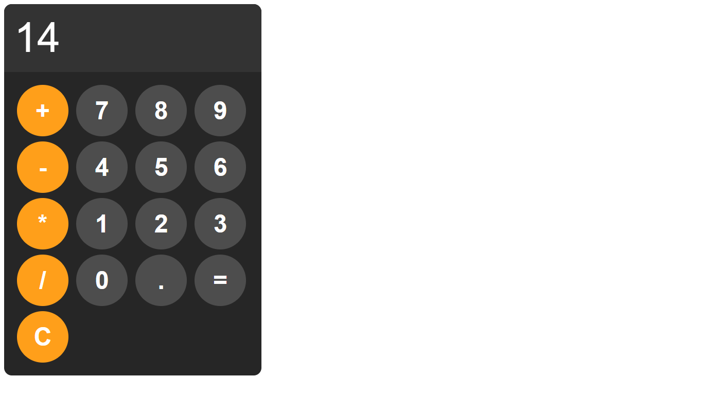
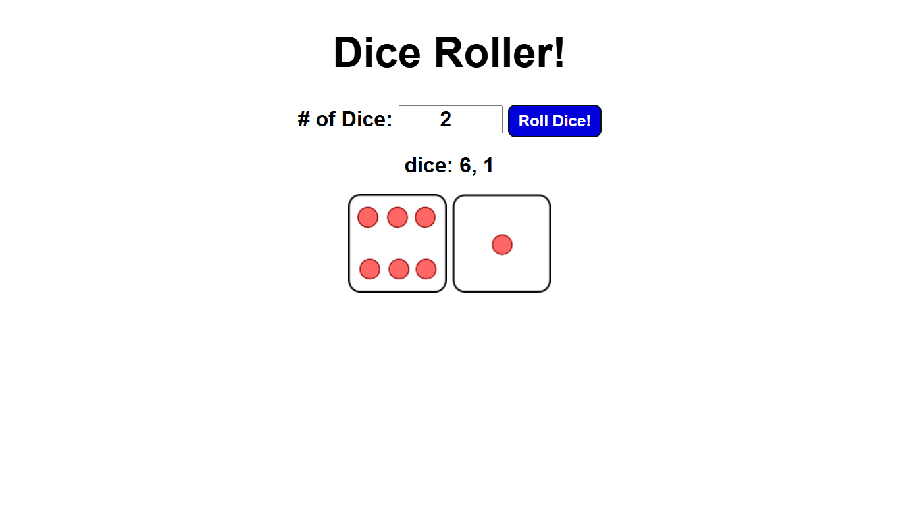
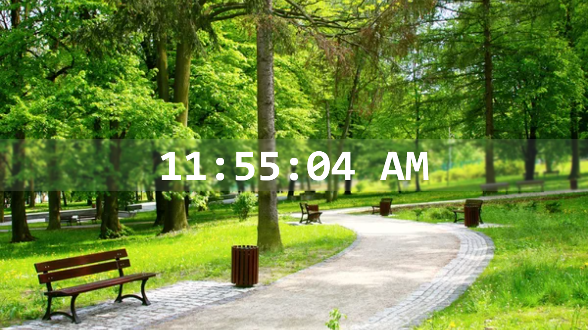
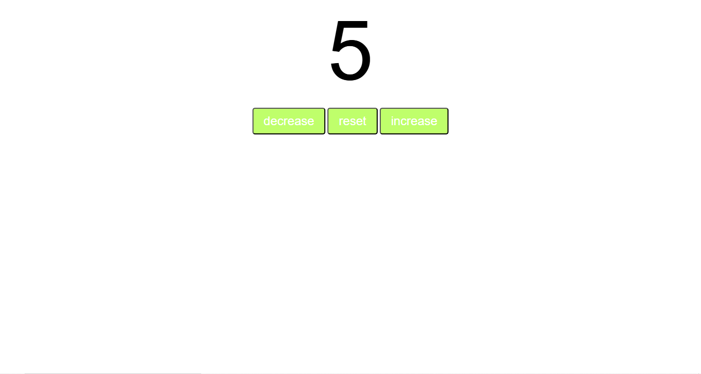
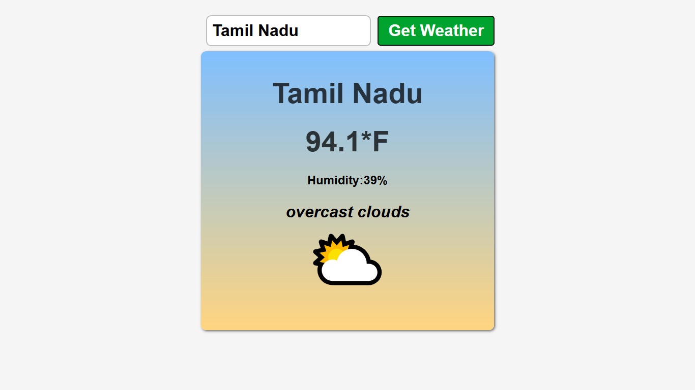

# My-Java-Projects
<h2>A Collection of My JavaScript Projects and Exercises</h2>
 

My Collection Of Project Includes:

<ul>
  <li>Calculator(<a href="#calculator-section">Goto</a>)</li>
  <li>Dice Roller(<a href="#diceroller-section">Goto</a>)</li>
  <li>Digital Clock(<a href="#digitalclock-section">Goto</a>)</li>
  <li>Image Slider(<a href="#imageslider-section">Goto</a>)</li>
  <li>Counter(<a href="#counter-section">Goto</a>)</li>
  <li>Weather App(<a href="#weather-section">Goto</a>)</li>
  <li>Circumference Finder(<a href="#circumference-section">Goto</a>)</li>
  <li>Number Guessing Game</li>
  <li>Random Password Generator</li>
  <li>Rock-Paper-Scissor Game</li>
  <li>Stop Watch</li>
  <li>Temperature Conversion</li>
  <li>Basic Layout Of Website</li>
</ul>
 

  <h2>Calculator</h2>
  
I made a calculator using javascript.it uses eval() global function to calculate the inputs.

  <kbd></kbd>

  <h2>Dice Roller</h2>
  
I made a Dice Roller using javascript.it uses Math.random() global Math object to generate random number between 0 ~ 1.we Multiply by 6 and +1 to get number between 1 and 6

  <kbd></kbd>

  <h2>Digital Clock</h2>
  
I made a Digital Clock using javascript.it uses Date().getHours,getMinutes,getSeconds global object to get the time

  <kbd></kbd>

  <h2>Image Slider</h2>
  
I made a Image Slider using javascript.it uses setIntervel() for auto slide image and use button for quick change left and right image

  <kbd></kbd>

  <h2>Counter</h2>
  
I made a Counter using javascript.it uses simple ++ and -- syntex to increase or decrease the number

  <kbd></kbd>

  <h2>Weather App</h2>
  
I made a Weather App using javascript.it uses api call to receive the data from api and display it

  <kbd></kbd>

  <h2>Circumference Finder</h2>
  
I made a Circumference Finder using javascript.it uses Math object like Math.PI() and get radius from user for process the data using formula 2πr 

  <kbd></kbd>

